# Ćwiczenie 4

## Podsumowanie

Cel: Reimplementacja sieci neuronowej w PyTorch i analiza wpływu hiperparametrów.

Dataset: Heart Disease Cleveland (split 80/20)

Przeprowadzone eksperymenty: 9 konfiguracji, 100 epok każda

Najlepszy wynik: SGD z lr=0.001, batch=32 
**86.89% test accuracy**

Niższy learning rate (0.001) daje lepszą generalizację niż wyższy (0.01/0.1), pomimo wolniejszej konwergencji.

## Opis

Reimplementacja sieci neuronowej z lab3 przy użyciu frameworka PyTorch. Analiza wpływu różnych hiperparametrów na wydajność modelu:

- Optimizer (SGD, Adam, RMSprop)
- Rozmiar batcha (8, 32, 64)
- Learning rate (0.0001, 0.001, 0.01, 0.1)

## Architektura sieci

Identyczna architektura jak w lab3:
- Warstwa wejściowa: 13 cech
- Warstwa ukryta: 32 neurony (ReLU)
- Warstwa wyjściowa: 2 klasy (softmax przez CrossEntropyLoss)

Model dziedziczy po `torch.nn.Module` i wykorzystuje `nn.Sequential` do budowy sieci.

## Implementacja

### Model (`model.py`)
```python
class HeartDiseaseNet(nn.Module):
    def __init__(self, input_dim=13, hidden_layers=[32], n_classes=2):
        super(HeartDiseaseNet, self).__init__()
        layers = []
        prev_size = input_dim
        for hidden_size in hidden_layers:
            layers.append(nn.Linear(prev_size, hidden_size))
            layers.append(nn.ReLU())
            prev_size = hidden_size
        layers.append(nn.Linear(prev_size, n_classes))
        self.network = nn.Sequential(*layers)
    
    def forward(self, x):
        return self.network(x)
```

### Pętla treningowa

Implementacja zgodna z konwencją PyTorch:

1. **Zero gradients**: `optimizer.zero_grad()`
2. **Forward pass**: `outputs = model(inputs)`
3. **Compute loss**: `loss = criterion(outputs, labels)`
4. **Backward pass**: `loss.backward()`
5. **Update weights**: `optimizer.step()`

## Eksperymenty

### Exp 1: Porównanie optimizerów

lr=0.01, batch_size=32, epochs=100

| Optimizer | Train Acc | Test Acc | Overfitting | Opis |
|-----------|-----------|----------|-------------|------|
| SGD | 98.76% | 81.97% | Duży | SGD z momentum=0.9 |
| Adam | 100.00% | 78.69% | Bardzo duży | Adaptive moment estimation |
| RMSprop | 100.00% | 83.61% | Bardzo duży | Root mean square propagation |

**Wnioski**:
- Wszystkie optimizery osiągają wysoką accuracy na zbiorze treningowym
- Adam i RMSprop osiągają 100% na train, ale gorzej generalizują
- SGD z lr=0.01 pokazuje oznaki overfittingu (98.76% train vs 81.97% test)
- RMSprop osiąga najlepszy wynik testowy spośród porównywanych (83.61%)

**Wykresy:**

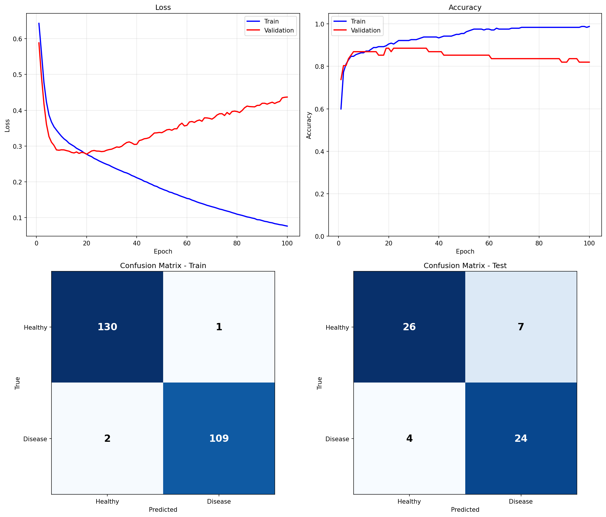
*SGD lr=0.01, batch=32*

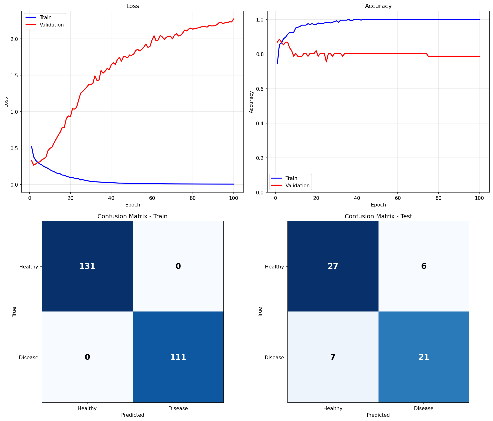
*Adam lr=0.01, batch=32*

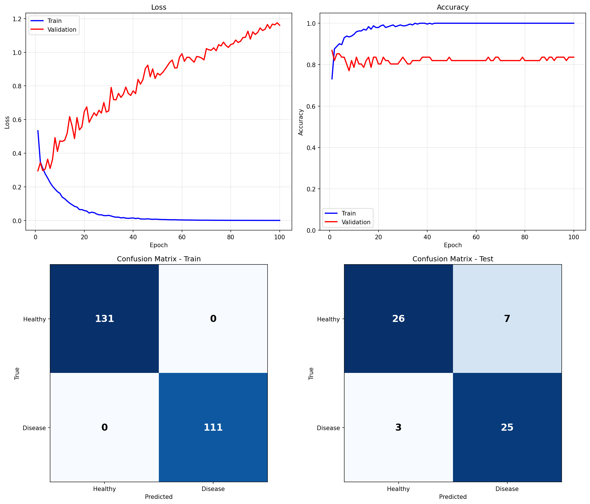
*RMSprop lr=0.01, batch=32*

### Exp 2: Wpływ rozmiaru batcha

optimizer=Adam, lr=0.01, epochs=100

| Batch Size | Train Acc | Test Acc | Overfitting | Uwagi |
|------------|-----------|----------|-------------|-------|
| 8 | 100.00% | 80.33% | Bardzo duży | Najwięcej aktualizacji |
| 32 | 100.00% | 78.69% | Bardzo duży | Baseline |
| 64 | 100.00% | 78.69% | Bardzo duży | Najmniej aktualizacji |

**Wnioski**:
- Wszystkie rozmiary batchy prowadzą do 100% train accuracy (overfitting)
- Mniejszy batch (8) daje nieznacznie lepszy wynik testowy (80.33%)
- Batch 32 i 64 dają identyczne wyniki testowe (78.69%)
- Przy wysokim learning rate (0.01) rozmiar batcha ma małe znaczenie
- Wszystkie konfiguracje cierpią na silny overfitting

**Wykresy:**

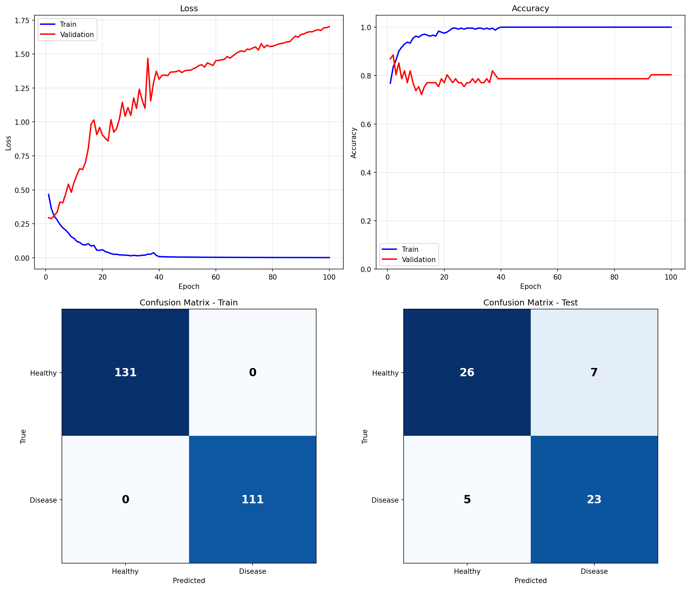
*Batch size = 8*


*Batch size = 32*

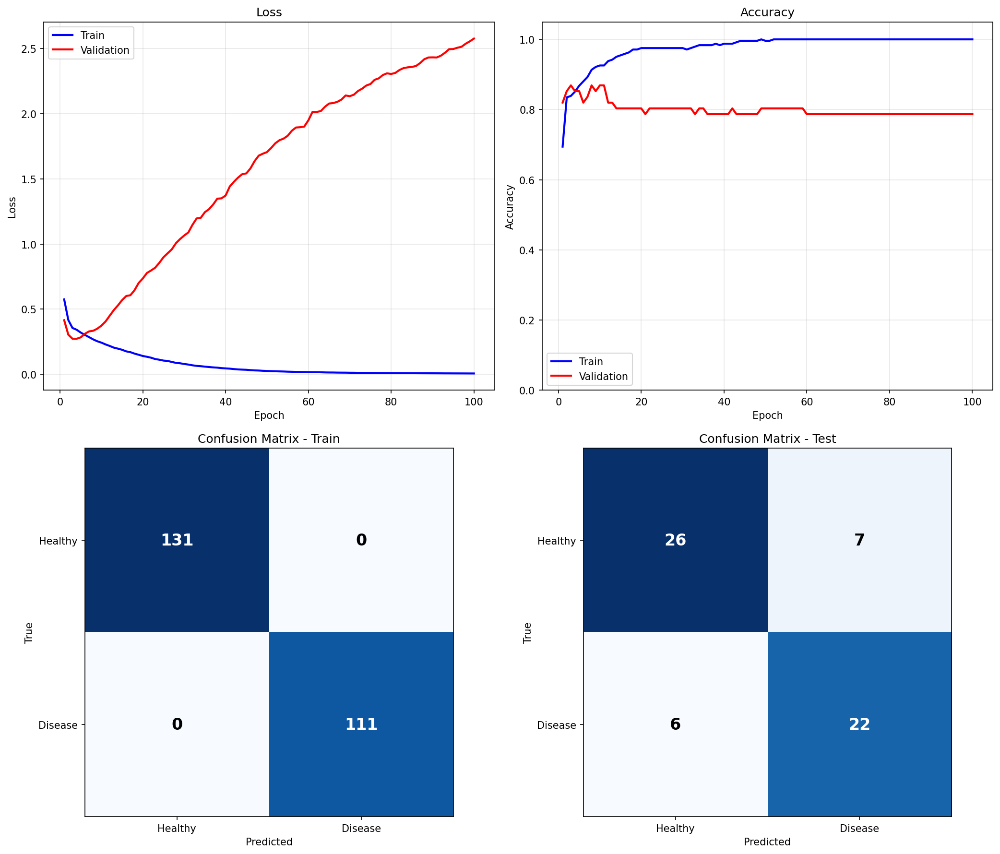
*Batch size = 64*

### Exp 3: Learning rate dla SGD

SGD (momentum=0.9), batch_size=32, epochs=100

| Learning Rate | Train Acc | Test Acc | Overfitting | Uwagi |
|---------------|-----------|----------|-------------|-------|
| 0.001 | 87.60% | 86.89% | Minimal | Najlepszy |
| 0.01 | 98.76% | 81.97% | Duży | Za szybkie uczenie |
| 0.1 | 100.00% | 80.33% | Bardzo duży | Zbyt wysoki LR |

**Wnioski**:
- **LR=0.001 to najlepsza konfiguracja**: 86.89% test accuracy, minimalny overfitting
- LR=0.01: szybsza konwergencja, ale więcej overfittingu
- LR=0.1: najszybsza konwergencja, 100% train acc, ale najgorsze generalizacja
- Niższy learning rate = lepsza generalizacja dla SGD

**Wykresy:**

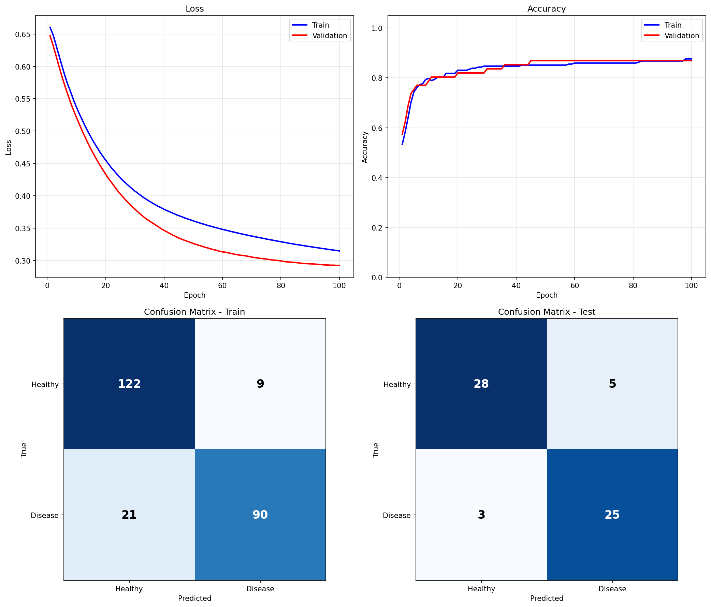
*SGD lr=0.001 - najlepsza konfiguracja!*


*SGD lr=0.01*

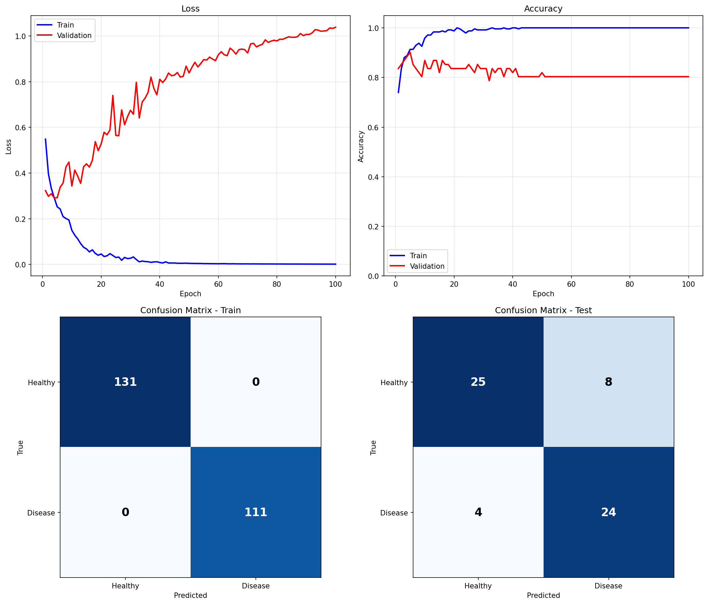
*SGD lr=0.1*

### Exp 4: Learning rate dla Adam

optimizer=Adam, batch_size=32, epochs=100

| Learning Rate | Train Acc | Test Acc | Overfitting | Uwagi |
|---------------|-----------|----------|-------------|-------|
| 0.0001 | 84.30% | 83.61% | Minimal | Wolna ale stabilna |
| 0.001 | 96.69% | 83.61% | Średni | Dobry kompromis |
| 0.01 | 100.00% | 78.69% | Bardzo duży | Za wysoki LR |

**Wnioski**:
- LR=0.001 i 0.0001 dają identyczny wynik testowy (83.61%)
- LR=0.0001: najwolniejsza konwergencja, najmniej overfittingu
- LR=0.001: szybsza konwergencja, akceptowalny overfitting
- LR=0.01: zbyt wysoki dla Adam, prowadzi do overfittingu
- Adam jest bardziej wrażliwy na learning rate niż SGD

**Wykresy:**

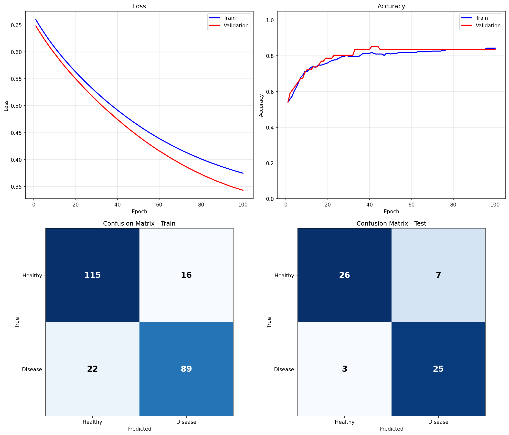
*Adam lr=0.0001*

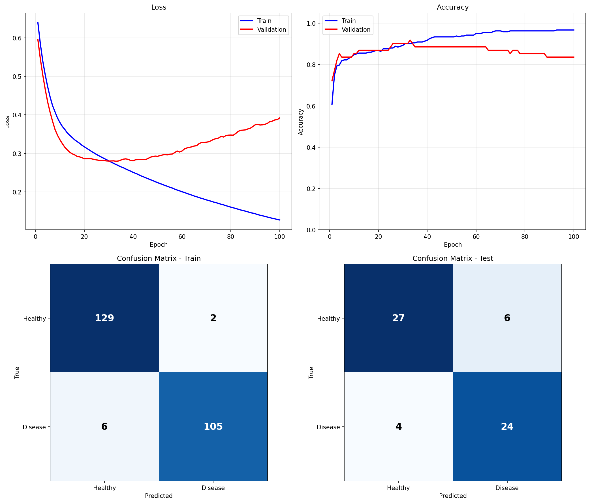
*Adam lr=0.001*


*Adam lr=0.01*

## Porównanie z implementacją własną (lab3)

| Aspekt | Lab3 (własna impl.) | Lab4 (PyTorch) |
|--------|---------------------|----------------|
| Backward pass | Ręczna implementacja | Automatyczna `backward()` |
| Optimizery | Tylko SGD | SGD, Adam, RMSprop |
| Wydajność | NumPy (CPU) | PyTorch (CPU/GPU) |
| Kod | ~300 linii (layers+network) (całość ok. 600) | ~150 linii |
| Flexibilność | Kontrola | Abstrakcje, wysokopoziomowe |
| Czas implementacji | (wraz z teorią) >15 godzin | 2 godziny |
| Podatność na błędy | Wysoka | Niska |
| Debugging | Trudny | Łatwiejszy |

**Kluczowe różnice:**
- nie trzeba ręcznie liczyć gradientów
- Gotowe optimizery z momentum, adaptive learning rates
- Mniej miejsca na błędy implementacyjne
- Łatwiejsze eksperymentowanie z różnymi konfiguracjami

## Najlepsze wyniki

SGD z lr=0.001, batch=32
- Train: 87.60%
- Test: 86.89%
- Minimalny overfitting (różnica < 1%)

**Ranking wszystkich konfiguracji (wg Test Acc):**

1. SGD lr=0.001: 86.89%
2. Adam lr=0.001/0.0001, RMSprop: 83.61%
3. SGD lr=0.01: 81.97%
4. Adam lr=0.01 bs=8: 80.33%
5. SGD lr=0.1: 80.33%
6. Adam lr=0.01 bs=32/64: 78.69%

### Wykresy porównawcze

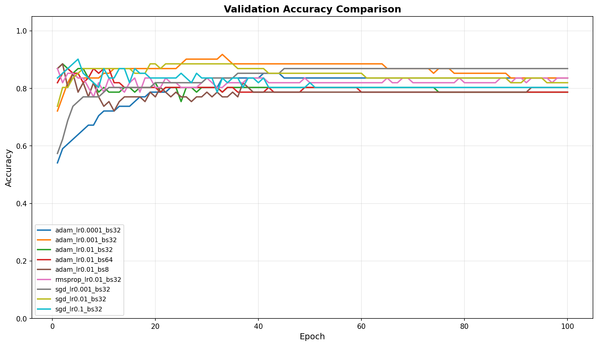
*Porównanie validation accuracy wszystkich konfiguracji*

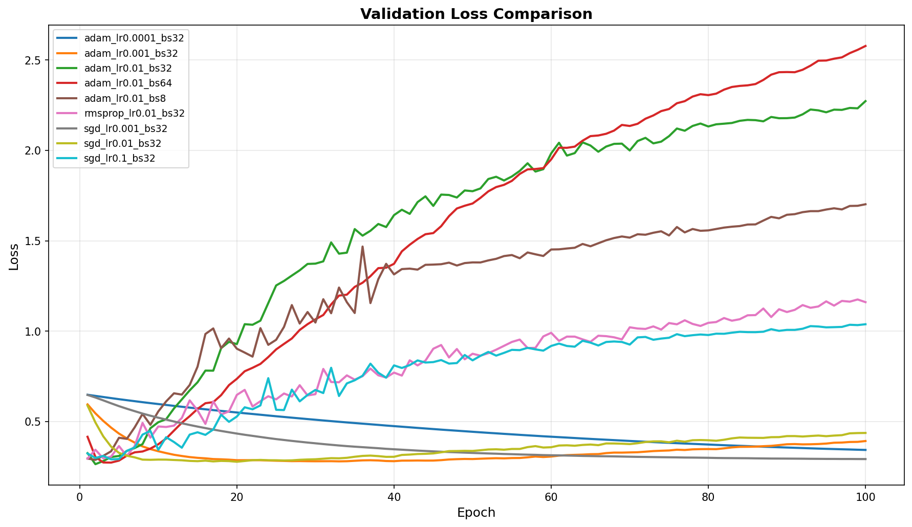
*Porównanie validation loss wszystkich konfiguracji*

## Wnioski

### Frameworki głębokiego uczenia

PyTorch zapewnia:

1. **Automatyczne różniczkowanie**: Graf obliczeniowy + `backward()`
2. **Optimizery**: Implementacje SGD, Adam, RMSprop z momentum
3. **Efektywność**: Operacje tensorowe zoptymalizowane (wdłg dokumentacji), wsparcie GPU
4. **Wygoda**: Mniej kodu, mniej błędów, o wiele większy komfort pracy + szybciej

### Wybór hiperparametrów - wnioski z eksperymentów

**Optimizer:**
- SGD z niskim LR (0.001) daje najlepsze wyniki
- Adam/RMSprop szybciej zbiegają, ale łatwiej o overfitting
- SGD wymaga dokładnego tuningu LR, ale nagradza lepszą generalizacją

**Learning Rate:**
- SGD: 0.001 optymalny, 0.01 za wysoki
- Adam: 0.001 lub 0.0001, nigdy 0.01
- Wyższy LR = szybsza konwergencja, ale większy overfitting

**Batch Size:**
- Przy wysokim LR (0.01) rozmiar batcha ma małe znaczenie
- Mniejsze batche (8) mogą dawać lekką przewagę
- Batch=32 to dobry standard

### Problem overfittingu

**Obserwacje:**
- Model z 994 parametrami i 242 próbkami treningowymi
- Większość konfiguracji osiąga 95-100% train accuracy
- Test accuracy spada do 78-87%
- Różnica 10-20%, może to być silny overfitting

**Rozwiązania:**
- Regularyzacja (L2, dropout)
- Early stopping
- Data augmentation
- Zwiększenie zbioru danych
- Zmniejszenie modelu

### Wnioski

1. Warto zacząć od SGD z lr=0.001 dla małych zbiorów danych
2. Należy monitorować różnicę train/test accuracy
3. Jeśli overfitting: pomaga zmniejszenie LR i dodanie regularyzacji
4. Adam dobre dla eksperymentów, SGD dla finalnego modelu
5. Adam z lr=0.01 to zły pomysł (zbyt wysoki!)

## Pliki

- `model.py` - Definicja modelu
- `train.py` - Skrypt treningowy
- `utils.py` - Ładowanie danych, zapis wyników
- `visualization.py` - Generowanie wykresów
- `compare_results.py` - Porównanie eksperymentów
- `run_experiments.sh` - Uruchomienie wszystkich eksperymentów
- `results/` - Wyniki, wykresy, modele

## Uruchomienie

```bash
source ../venv/bin/activate

python train.py --optimizer adam --learning-rate 0.001 --batch-size 32 --epochs 100

./run_experiments.sh

python compare_results.py
```
