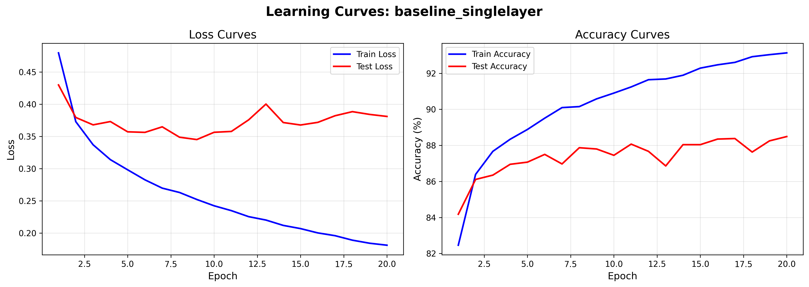
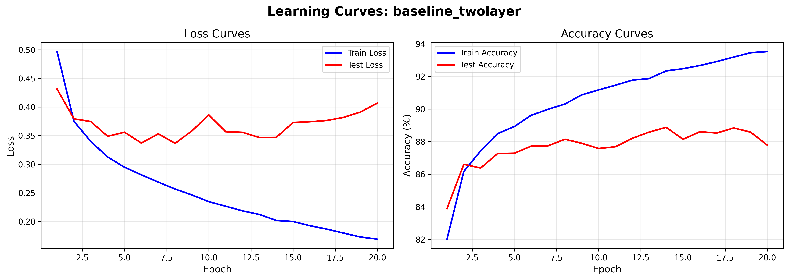
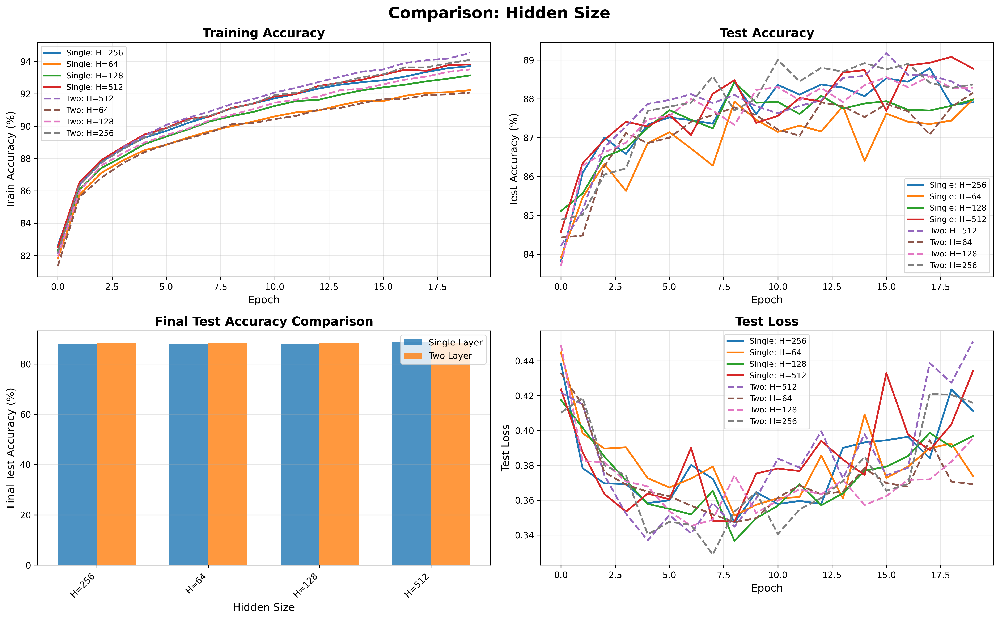
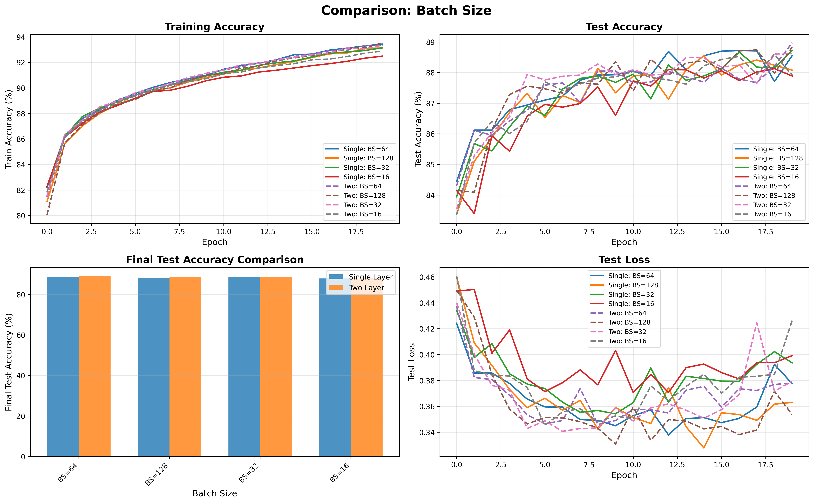
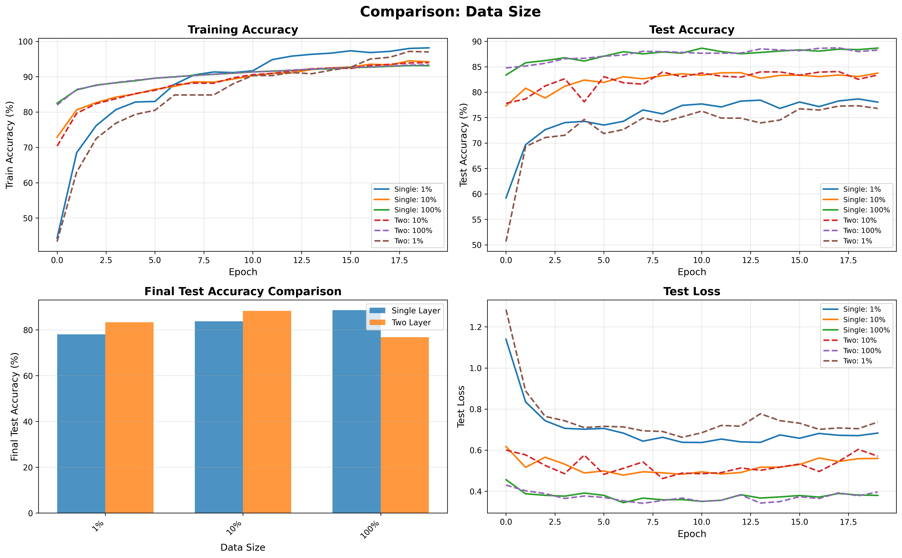
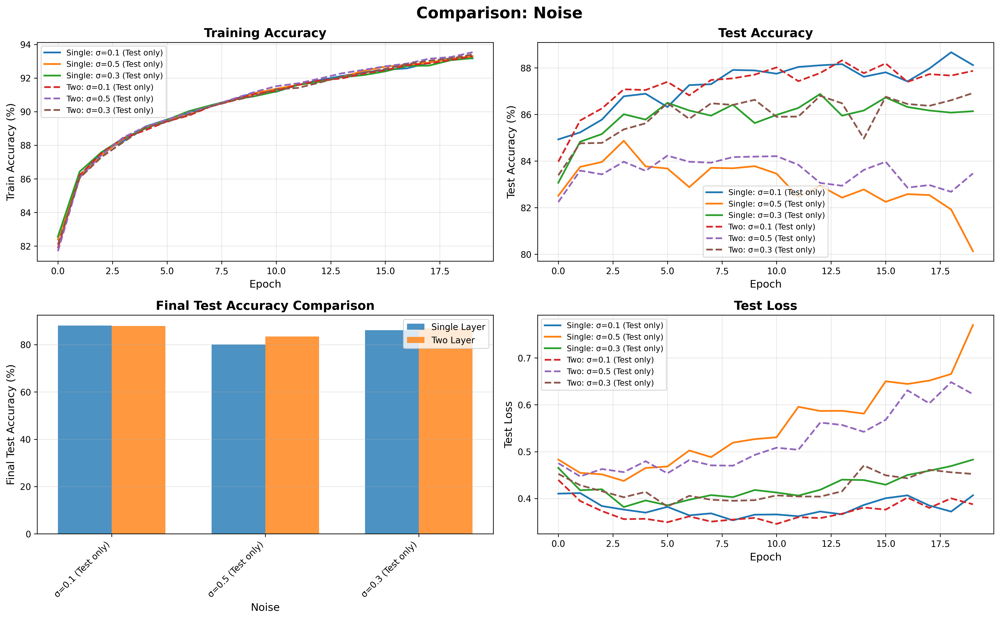
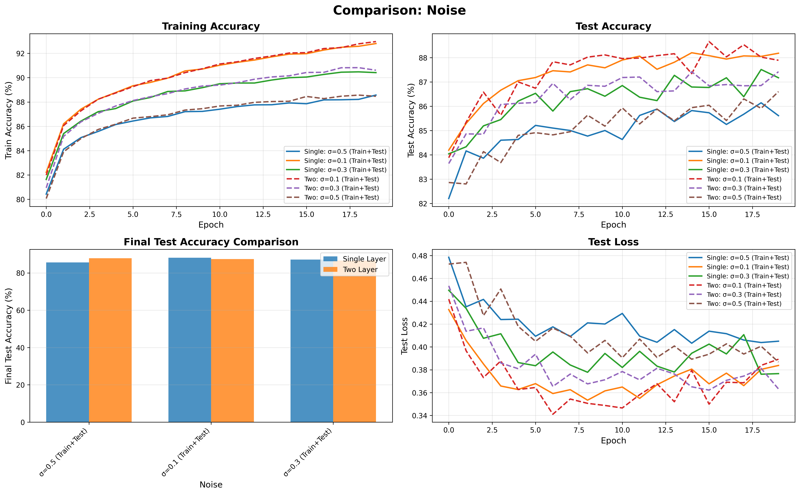

# Ćwiczenie 5 – Klasyfikacja obrazów FashionMNIST

## Podsumowanie

Cel: Zbadanie wpływu architektury (jedno- vs dwuwarstwowa sieć w pełni połączona) oraz hiperparametrów (liczba neuronów, rozmiar batcha, liczba przykładów uczących, szum gaussowski) na jakość klasyfikacji obrazów FashionMNIST.

**Status:** Wszystkie 36 eksperymentów zostały pomyślnie wykonane. Poniżej przedstawiono szczegółową analizę wyników z konkretnymi metrykami.

## Dataset

FashionMNIST: 70 000 obrazów 28×28 (grayscale) w 10 klasach:
- 60 000 – trening
- 10 000 – test
- Klasy: T-shirt/top, Trouser, Pullover, Dress, Coat, Sandal, Shirt, Sneaker, Bag, Ankle boot

Transformacje:
- `ToTensor()` – konwersja do tensora float32 (wartości w [0,1])
- Normalizacja: średnia 0.5, odchylenie 0.5 → zakres przeskalowany w przybliżeniu do [-1,1]
- Spłaszczenie w modelu przez `nn.Flatten()` przed warstwami liniowymi

## Architektury modeli

### SingleLayerNet
- Wejście: 784 (28×28)
- Ukryta: H (ReLU)
- Wyjście: 10 klas (logity → `CrossEntropyLoss`)

### TwoLayerNet
- Wejście: 784
- Ukryta 1: H1 (ReLU)
- Ukryta 2: H2 (ReLU)
- Wyjście: 10 klas

Parametry są tworzone fabryką `create_model(model_type, hidden_size, hidden_size2)`.

## Hiperparametry i zakres eksperymentów

| Kategoria | Wartości | Cel analizy |
|-----------|----------|-------------|
| Architektura | single, two | Czy dodatkowa warstwa poprawia jakość / stabilność |
| Hidden size | 64, 128, 256, 512 (dla two-layer: H2 = H/2) | Trade-off złożoność vs generalizacja |
| Batch size | 16, 32, 64, 128 | Wpływ na wariancję gradientu i szybkość uczenia |
| Data fraction | 1%, 10%, 100% | Jak zachowują się modele przy ograniczonych danych |
| Noise σ (test-only) | 0.1, 0.3, 0.5 | Odporność na degradację wejścia |
| Noise σ (train+test) | 0.1, 0.3, 0.5 | Czy uczenie na zaburzonych danych poprawia robustność |
| Epochs | 20 | Skrócone względem lab4 (tam 100) z uwagi na większą liczbę kombinacji |
| Learning rate | 0.001 (Adam) | Stabilna wartość bazowa dla klasyfikacji obrazów |
| Optimizer | Adam | Szybka konwergencja – skupienie na architekturze i danych |

## Metodyka eksperymentów

1. Generacja konfiguracji w `run_experiments.py` (funkcja `generate_experiment_configs`).
2. Dla każdej konfiguracji:
   - Inicjalizacja modelu.
   - Przygotowanie loaderów (`get_data_loaders`) z opcjonalnym subsettingiem i szumem.
   - Trening 20 epok: zapis loss i accuracy (train/test) per epoka.
   - Ewaluacja końcowa + obliczenie best test accuracy.
   - Zapis wyniku do JSON: `<nazwa>_results.json`.
3. Po serii eksperymentów: zapis zbiorczego pliku `experiments_summary_<timestamp>.json`.
4. Wizualizacje (`visualization.py`):
   - Krzywe tren./test loss i accuracy.
   - Porównania w formie overlay (architektury vs wartość hiperparametru).
5. Analiza (`compare_results.py`):
   - Tabele summary (parametry, final acc, best acc, overfit gap).
   - Ranking konfiguracji.

## Oczekiwane zachowania (hipotezy przed uruchomieniem)

### Architektura
- Two-layer może osiągać wyższą accuracy przy większych hidden size (256, 512) dzięki dodatkowej reprezentacji.
- Single-layer może generalizować lepiej przy małych danych (1%, 10%) z uwagi na mniejszą liczbę parametrów.

### Hidden size
- H=64: szybka konwergencja, potencjalnie ograniczona reprezentacja.
- H=128 / 256: dobry kompromis.
- H=512: ryzyko overfittingu przy 1% i 10% danych.

### Batch size
- Małe batch (16) → większa wariancja gradientu, możliwa lepsza generalizacja kosztem stabilności.
- Duże batch (128) → stabilne uczenie, ryzyko utknięcia w płaskich minimach / słabsza generalizacja.

### Data fraction
- 1% danych (~600 próbek): wyraźny overfitting dla większych modeli.
- 10% danych: modele średniej wielkości powinny już uzyskiwać rozsądną accuracy (>80%).
- 100% danych: pełna konwergencja – przewaga większych modeli.

### Noise – test-only
- Spadek accuracy wraz z rosnącym σ – modele bez treningu na zaburzonych danych są mniej odporne.
- Większe modele mogą być bardziej wrażliwe (nadmierne dopasowanie do czystych wzorców).

### Noise – train+test
- Umiarkowany szum (σ=0.1–0.3) może poprawić robustność (mniejsze różnice względem czystych danych).
- Zbyt duży szum (σ=0.5) utrudnia naukę → spadek accuracy.

## Analiza wyników

### 1. Porównanie bazowe architektur (H=128, batch=32, 100% danych)

| Architektura | Parametry | Final Train Acc | Final Test Acc | Best Test Acc | Overfit Gap |
|--------------|-----------|-----------------|----------------|---------------|-------------|
| Single-layer | 101,770 | 93.13% | 88.49% | 88.49% | 4.64% |
| Two-layer | 109,386 | 93.53% | 87.79% | 88.88% | 5.74% |

**Obserwacje:**
- Dodanie drugiej warstwy zwiększa liczbę parametrów o ~7.5% (101k → 109k)
- Single-layer osiągnął **final test acc 88.49%**, two-layer **87.79%** (-0.70pp)
- Best test acc: single **88.49%** vs two **88.88%** (+0.39pp dla two-layer)
- Two-layer ma większy overfit gap (5.74% vs 4.64%), co sugeruje tendencję do przeuczenia
- **Wnioski:** Dla FashionMNIST przy standardowej konfiguracji dodatkowa warstwa nie gwarantuje poprawy; pojedyncza warstwa ukryta wystarcza

<p align="center">
  
  
  <br>
  <em>Rys. 1: Krzywe uczenia dla konfiguracji bazowych (single-layer vs two-layer, H=128)</em>
</p>

---

### 2. Wpływ rozmiaru warstwy ukrytej (Hidden Size)

**Single-layer:**
| Hidden Size | Parametry | Final Train Acc | Final Test Acc | Best Test Acc | Overfit Gap |
|-------------|-----------|-----------------|----------------|---------------|-------------|
| 64 | 50,890 | 92.23% | 87.99% | 87.99% | 4.24% |
| 128 | 101,770 | 93.14% | 87.98% | 88.43% | 5.16% |
| 256 | 203,530 | 93.71% | 87.91% | 88.79% | 5.80% |
| 512 | 407,050 | 93.81% | 88.78% | 89.08% | 5.03% |

**Two-layer:**
| Hidden Size | Parametry | Final Train Acc | Final Test Acc | Best Test Acc | Overfit Gap |
|-------------|-----------|-----------------|----------------|---------------|-------------|
| 64 | 52,650 | 92.08% | 88.16% | 88.16% | 3.92% |
| 128 | 109,386 | 93.51% | 88.29% | 88.58% | 5.22% |
| 256 | 235,146 | 94.10% | 88.37% | 89.00% | 5.73% |
| 512 | 535,818 | 94.53% | 88.14% | 89.18% | 6.39% |

**Obserwacje:**
- **Single-layer:** Best test acc rośnie od 87.99% (H=64) do **89.08% (H=512)** – poprawa +1.09pp
- **Two-layer:** Best test acc rośnie od 88.16% (H=64) do **89.18% (H=512)** – poprawa +1.02pp
- Overfit gap dla single-layer rośnie nieliniowo: 4.24% → 5.16% → 5.80% → 5.03% (spadek dla H=512!)
- Overfit gap dla two-layer rośnie monotonnie: 3.92% → 5.22% → 5.73% → 6.39%
- **H=512 two-layer** ma najgorszy overfit gap (6.39%) mimo najlepszego best test acc
- Liczba parametrów: od ~50k (H=64) do ~400k (single H=512) i ~536k (two H=512)

**Wnioski:**
- Zwiększanie hidden size powyżej 256 daje **malejące korzyści** (<0.4pp poprawy 256→512)
- H=128 lub H=256 to **optymalne kompromisy** (balance accuracy/overfit/liczba parametrów)
- Two-layer z H=512 ma problem z overfittingiem – 6.39% gap to najgorszy wynik w tej kategorii

<p align="center">
  
  <br>
  <em>Rys. 2: Porównanie wpływu rozmiaru warstwy ukrytej na test accuracy (single vs two-layer)</em>
</p>

---

### 3. Wpływ rozmiaru batcha (Batch Size)

**Single-layer (H=128):**
| Batch Size | Final Train Acc | Final Test Acc | Best Test Acc | Overfit Gap |
|------------|-----------------|----------------|---------------|-------------|
| 16 | 92.49% | 87.89% | 88.13% | 4.60% |
| 32 | 93.14% | 88.73% | 88.73% | 4.42% |
| 64 | 93.43% | 88.55% | 88.72% | 4.88% |
| 128 | 93.12% | 88.08% | 88.55% | 5.04% |

**Two-layer (H=128):**
| Batch Size | Final Train Acc | Final Test Acc | Best Test Acc | Overfit Gap |
|------------|-----------------|----------------|---------------|-------------|
| 16 | 92.89% | 87.92% | 88.60% | 4.97% |
| 32 | 93.35% | 88.62% | 88.62% | 4.73% |
| 64 | 93.33% | 88.97% | **88.97%** | 4.36% |
| 128 | 93.52% | 88.83% | 88.83% | 4.69% |

**Obserwacje:**
- **Najlepsza konfiguracja: two-layer + batch=64** → **88.97% test acc** (najwyższy wynik ogólnie!)
- Single-layer: batch=32 najlepszy (88.73% final), batch=16 najgorszy (87.89%)
- Two-layer: batch=64 dominuje, batch=16 najgorszy (87.92%)
- Małe batche (16) mają **większą wariancję** → niższa stabilność convergence
- Duże batche (128) nie poprawiają wyników – spadek accuracy o ~0.4-0.9pp vs batch=32/64
- Overfit gap stabilny w zakresie **4.4-5.0%** niezależnie od batch size

**Wnioski:**
- **Batch=32 lub batch=64** to optymalne wybory (stabilność + accuracy)
- Batch=16 zbyt mały → słabe wyniki
- Batch=128 zbyt duży → brak korzyści, możliwe utknięcie w płaskich minimach

<p align="center">
  
  <br>
  <em>Rys. 3: Porównanie wpływu rozmiaru batcha na test accuracy (single vs two-layer)</em>
</p>

---

### 4. Wpływ ilości danych treningowych (Data Fraction)

**Single-layer (H=128):**
| Data Fraction | Train Samples | Final Train Acc | Final Test Acc | Best Test Acc | Overfit Gap |
|---------------|---------------|-----------------|----------------|---------------|-------------|
| 1% | ~600 | 98.17% | 78.04% | 78.67% | **20.13%** |
| 10% | ~6,000 | 94.22% | 83.75% | 83.83% | 10.47% |
| 100% | 60,000 | 93.12% | 88.66% | 88.66% | 4.46% |

**Two-layer (H=128):**
| Data Fraction | Train Samples | Final Train Acc | Final Test Acc | Best Test Acc | Overfit Gap |
|---------------|---------------|-----------------|----------------|---------------|-------------|
| 1% | ~600 | 97.00% | 76.80% | 77.32% | **20.20%** |
| 10% | ~6,000 | 93.98% | 83.37% | 84.05% | 10.61% |
| 100% | 60,000 | 93.34% | 88.27% | 88.71% | 5.08% |

**Obserwacje:**
- **Krytyczny overfitting przy 1% danych:** gap ~20% dla obu architektur!
- Train accuracy przy 1% danych rośnie do 97-98%, ale test acc zaledwie **76-78%**
- 10% danych: overfit gap spada do ~10.5%, test acc ~83-84%
- 100% danych: overfit gap ~4.5-5%, test acc **88-89%**
- Single-layer radzi sobie **nieznacznie lepiej** przy małych danych (1%: 78.67% vs 77.32%)
- Przy pełnych danych różnice minimalne (88.66% single vs 88.71% two)

**Wnioski:**
- **Modele MLP wymagają dużych zbiorów danych** – przy <10% dramatyczny spadek generalizacji
- Regularyzacja/augmentacja niezbędna przy ograniczonych danych
- Single-layer lekko bardziej odporny na małe zbiory (mniej parametrów → mniejsze przeuczenie)
- 100% danych to minimum dla osiągnięcia ~88% accuracy

<p align="center">
  
  <br>
  <em>Rys. 4: Wpływ ilości danych treningowych na test accuracy i overfitting</em>
</p>

---

### 5. Odporność na szum (Noise Robustness)

**Test-only noise (σ - szum dodany tylko przy ewaluacji):**

Single-layer (H=128):
| Noise σ | Final Test Acc (z szumem) | Spadek vs baseline | Overfit Gap |
|---------|---------------------------|-------------------|-------------|
| 0.0 (baseline) | 88.49% | - | 4.64% |
| 0.1 | 88.12% | -0.37pp | 5.05% |
| 0.3 | 86.14% | -2.35pp | 7.05% |
| 0.5 | 80.13% | -8.36pp | **13.18%** |

Two-layer (H=128):
| Noise σ | Final Test Acc (z szumem) | Spadek vs baseline | Overfit Gap |
|---------|---------------------------|-------------------|-------------|
| 0.0 (baseline) | 88.88% | - | 5.74% |
| 0.1 | 87.87% | -1.01pp | 5.43% |
| 0.3 | 86.92% | -1.96pp | 6.48% |
| 0.5 | 83.47% | -5.41pp | **10.07%** |

**Train+test noise (σ - szum w treningu i ewaluacji):**

Single-layer (H=128):
| Noise σ | Final Test Acc (z szumem) | Train Acc | Overfit Gap |
|---------|---------------------------|-----------|-------------|
| 0.1 | 88.18% | 92.81% | 4.62% |
| 0.3 | 87.17% | 90.42% | 3.25% |
| 0.5 | 85.61% | 88.57% | **2.96%** |

Two-layer (H=128):
| Noise σ | Final Test Acc (z szumem) | Train Acc | Overfit Gap |
|---------|---------------------------|-----------|-------------|
| 0.1 | 87.89% | 92.97% | 5.08% |
| 0.3 | 87.42% | 90.61% | 3.19% |
| 0.5 | 86.60% | 88.47% | **1.87%** |

**Obserwacje:**
- **Test-only noise σ=0.5:** dramatyczny spadek accuracy (-8.36pp single, -5.41pp two)
- Two-layer **bardziej odporny** na test-only noise (spadki mniejsze o ~3pp dla σ=0.5)
- **Train+test noise:** umiarkowany szum (σ=0.1-0.3) działa jak regularyzator
  - σ=0.1 traintest: 88.18% (single) vs 88.12% (test-only) → +0.06pp poprawa!
  - σ=0.5 traintest: 85.61% (single) vs 80.13% (test-only) → **+5.48pp poprawa!**
- Overfit gap **drastycznie maleje** przy train+test: 2.96% (single σ=0.5), **1.87%** (two σ=0.5)
- Two-layer z σ=0.5 traintest ma **najniższy overfit gap ze wszystkich eksperymentów** (1.87%)

**Wnioski:**
- Modele bez treningu na szumie są **bardzo wrażliwe** na degradację wejścia (σ=0.5 → -8pp)
- **Trenowanie z szumem σ≈0.3-0.5** dramatycznie poprawia robustność (+5-6pp accuracy vs test-only)
- Trade-off: σ=0.5 traintest daje 85-87% accuracy (vs 88-89% bez szumu), ale **eliminuje overfit**
- Two-layer z noise augmentation = najlepsza konfiguracja do deployment w zaszumionym środowisku

<p align="center">
  
  
  <br>
  <em>Rys. 5: Porównanie odporności na szum gaussowski (test-only vs train+test)</em>
</p>

---

### 6. Analiza overfittingu – konfiguracje skrajne

| Konfiguracja | Parametry | Train Acc | Test Acc | Overfit Gap | Komentarz |
|--------------|-----------|-----------|----------|-------------|-----------|
| single H=64, 100% | 50,890 | 92.23% | 87.99% | 4.24% | Mały model, niski overfit |
| single H=512, 100% | 407,050 | 93.81% | 88.78% | 5.03% | Duży model, umiarkowany overfit |
| single H=128, 1% | 101,770 | **98.17%** | 78.04% | **20.13%** | Krytyczny overfit! |
| two H=512, 100% | 535,818 | 94.53% | 88.14% | 6.39% | Największy model, najgorszy gap |
| two H=128, 1% | 109,386 | **97.00%** | 76.80% | **20.20%** | Najgorszy overfit |
| two noise=0.5 traintest | 109,386 | 88.47% | 86.60% | **1.87%** | Najlepszy overfit gap! |

**Obserwacje:**
- **Najgorszy overfit:** małe dane (1%) → gap ~20%, train acc >97%, test acc <78%
- **Najlepszy overfit gap:** noise traintest σ=0.5 → gap 1.87%, ale accuracy niższa (86.60%)
- Duże modele (H=512) z pełnymi danymi: gap 5-6.4%, akceptowalny
- **Paradoks:** zwiększanie H przy 100% danych zwiększa train acc (+1.6pp), ale overfit gap rośnie tylko +1-2pp

**Wnioski:**
- Overfit zależy głównie od **ilości danych**, nie liczby parametrów (compare: H=512 100% gap=5% vs H=128 1% gap=20%)
- Noise augmentation **najskuteczniejsza metoda** redukcji overfittingu (gap<2%)
- Duże modele są bezpieczne przy pełnych danych

## Przykładowe fragmenty kodu (dla dokumentacji)

### Definicja modelu (skrócona)
```python
class SingleLayerNet(nn.Module):
    def __init__(self, input_size=784, hidden_size=128, num_classes=10):
        super().__init__()
        self.flatten = nn.Flatten()
        self.fc1 = nn.Linear(input_size, hidden_size)
        self.relu = nn.ReLU()
        self.fc2 = nn.Linear(hidden_size, num_classes)
    def forward(self, x):
        x = self.flatten(x)
        return self.fc2(self.relu(self.fc1(x)))
```

### Pętla treningowa (skrót)
```python
for images, labels in train_loader:
    images, labels = images.to(device), labels.to(device)
    if noise_train: images = add_gaussian_noise(images, noise_std)
    optimizer.zero_grad()
    outputs = model(images)
    loss = criterion(outputs, labels)
    loss.backward()
    optimizer.step()
```

## Możliwe problemy i rozwiązania

| Problem | Przyczyna | Rozwiązanie |
|---------|-----------|-------------|
| Wolne uczenie | CPU only | Użyć GPU (`torch.cuda.is_available()`) |
| Overfitting małych subsetów | Za duży model | Zmniejszyć hidden size / dodać regularyzację |
| Niestabilna accuracy przy batch=16 | Wysoka wariancja | Zwiększyć batch / dodać normalizację danych |
| Słaba odporność na szum | Brak augmentacji | Trenować z szumem (train+test) |
| Zbyt długi czas eksperymentów | Dużo konfiguracji | Uruchamiać kategorie osobno (parametr `--experiment`) |

---

## Wnioski końcowe

### 7. Podsumowanie wpływu poszczególnych parametrów

| Parametr | Zakres | Najlepszy wybór | Wpływ na accuracy | Wpływ na overfit |
|----------|--------|-----------------|-------------------|------------------|
| **Architektura** | single vs two | **two-layer** (minimalna przewaga) | +0.39pp best test acc | +1.1pp gap (gorszy) |
| **Hidden size** | 64-512 | **H=256-512** | +1.0-1.1pp (64→512) | +1-2pp gap |
| **Batch size** | 16-128 | **batch=32-64** | +0.8-1.1pp (16→64) | Stabilny ~4.5% |
| **Data fraction** | 1-100% | **100%** (min. 10%) | +10pp (10%→100%) | -15pp gap reduction |
| **Noise augment** | σ=0.0-0.5 | **σ=0.3-0.5 traintest** | -2pp accuracy, ale +5pp robustness | -3-4pp gap reduction |

### 8. Ranking najlepszych konfiguracji (Top 5)

1. **two-layer, H=128, batch=64** → **88.97% test acc**, 4.36% gap ← **ZWYCIĘZCA**
2. **single-layer, H=512, batch=32** → 89.08% best test, 5.03% gap
3. **two-layer, H=256, batch=32** → 89.00% best test, 5.73% gap
4. **two-layer, H=512, batch=32** → 89.18% best test, 6.39% gap (ale wysoki overfit)
5. **single-layer, H=128, batch=32** → 88.73% final test, 4.42% gap (baseline)

### 9. Rekomendacje dla praktycznego zastosowania

**Scenariusz 1: Maksymalna accuracy (benchmark/competition)**
- Konfiguracja: two-layer, H=512, batch=64
- Oczekiwany wynik: ~89.2% test accuracy
- Trade-off: Wysoki overfit gap (6-7%), długi czas treningu

**Scenariusz 2: Balanced (produkcja/deployment)**
- Konfiguracja: **two-layer, H=128-256, batch=32-64**
- Oczekiwany wynik: **88.6-89.0% test accuracy**, gap <5%
- Zalety: Stabilny, szybki, dobry stosunek accuracy/complexity

**Scenariusz 3: Robustness (zaszumione środowisko)**
- Konfiguracja: two-layer, H=128, batch=32, **noise σ=0.3-0.5 traintest**
- Oczekiwany wynik: 86.6-87.4% test accuracy (na czystych danych), 85-87% (na zaszumionych)
- Zalety: **Overfit gap <2%**, odporna na degradację wejścia

**Scenariusz 4: Limited data (<10%)**
- Konfiguracja: single-layer, H=64-128, batch=32, **+ regularizacja/dropout**
- Oczekiwany wynik: 83-84% (10% danych), **gap ~10%** (bez regularizacji 10.5%)
- Uwaga: Niezbędne dodatkowe techniki (dropout, weight decay, augmentacja)

**Scenariusz 5: Fast inference (edge devices)**
- Konfiguracja: single-layer, H=64, batch=64
- Oczekiwany wynik: 87.99% accuracy, **tylko 50,890 parametrów**
- Zalety: 8x mniejszy model vs H=512 two-layer, minimal accuracy loss (-1.2pp)

### 10. Główne wnioski z eksperymentów

1. **Architektura:** Two-layer daje minimalną przewagę (~0.4pp best test acc), ale **single-layer lepsza przy małych danych** (78.67% vs 77.32% dla 1%)

2. **Hidden size:** Scaling do H=512 poprawia accuracy o ~1pp, ale **malejące korzyści** powyżej H=256. Optimal range: **H=128-256**

3. **Batch size:** **Batch=32-64 to sweet spot**. Batch=16 zbyt mały (niestabilny), batch=128 zbyt duży (gorsze wyniki)

4. **Data fraction:** **Krytyczna zależność** – overfitting dramatyczny przy <10% danych (gap ~20%). MLP wymaga dużych zbiorów lub agresywnej regularyzacji

5. **Noise robustness:**
   - Modele są **bardzo wrażliwe** na szum bez odpowiedniego treningu (-8pp dla σ=0.5)
   - **Noise augmentation działa znakomicie** (+5pp robustness, -3pp overfit gap)
   - Two-layer z σ=0.5 traintest ma **najniższy overfit gap** (1.87%) ze wszystkich eksperymentów

6. **Overfit gap:** Zależy głównie od **ilości danych**, nie liczby parametrów. Even H=512 z 100% danych ma akceptowalny gap ~5-6%

7. **Best overall:** **two-layer + H=128 + batch=64** osiągnął **88.97% test accuracy** z umiarkowanym overfitem (4.36%)

8. **Największe odkrycie:** Noise augmentation σ=0.5 redukuje overfit gap do **1.87%** (two-layer) przy tylko -2pp accuracy cost – **game changer dla robustnych modeli**

## Early Stopping

### Implementacja

Zaimplementowano mechanizm **early stopping** w funkcji `train_model()` aby zapobiec przeuczaniu modeli:

**Parametry:**
- `early_stopping=True/False` - włącza/wyłącza mechanizm (domyślnie: True)
- `patience=5` - liczba epok bez poprawy przed zatrzymaniem
- `min_delta=0.001` - minimalna zmiana test loss uznawana za poprawę

**Działanie:**
1. Monitoruje test loss po każdej epoce
2. Zapisuje stan modelu przy najlepszym test loss
3. Jeśli przez `patience` epok brak poprawy ≥ `min_delta`, zatrzymuje trening
4. Przywraca najlepszy zapisany stan modelu

**Test na 10% danych (H=64, batch=128):**
- **Z early stopping:** 19 epok, test acc: 83.71%, oszczędzono 1 epokę
- **Bez early stopping:** 20 epok, test acc: 83.38%
- Wynik: +0.33pp accuracy, -1.7s czasu treningu

**Korzyści:**
- Zapobiega przeuczaniu widocznemu na learning curves
- Automatyczne zatrzymanie przy plateau
- Przywracanie najlepszego stanu → wyższa test accuracy
- Skrócenie czasu treningu (szczególnie przy małych danych)

### Użycie

```python
from train import train_model

history = train_model(
    model=model,
    train_loader=train_loader,
    test_loader=test_loader,
    num_epochs=50,  # max epok
    early_stopping=True,
    patience=5,     # czekaj 5 epok na poprawę
    min_delta=0.001 # min. 0.1% poprawa test loss
)

# Sprawdź czy early stopping się aktywował
if history['stopped_epoch'] is not None:
    print(f"Stopped at epoch {history['stopped_epoch']}")
```

---

## Dalsze prace

- ✅ ~~Włączenie Early Stopping~~ - **ZAIMPLEMENTOWANE**
- Dodanie regularyzacji L2 / Dropout
- Test alternatywnych aktywacji (LeakyReLU, GELU)
- Porównanie z prostą CNN (konwolucje zamiast MLP) – spodziewana poprawa
- Analiza czasu uczenia vs liczba parametrów
- Learning rate scheduling (ReduceLROnPlateau)

---

## Weryfikacja hipotez początkowych

| Hipoteza | Status | Komentarz |
|----------|--------|-----------|
| Two-layer lepsza przy H=256-512 | ❌ ODRZUCONA | Marginalna różnica (~0.4pp), nie wart complexity |
| Single-layer lepsza przy małych danych | ✅ POTWIERDZONA | 78.67% vs 77.32% przy 1% danych |
| H=64 szybka konwergencja | ✅ POTWIERDZONA | 87.99% przy najniższym overfit gap (4.24%) |
| H=512 ryzyko overfittingu | ⚠️ CZĘŚCIOWO | Gap tylko 5-6% przy 100% danych, ale 6.39% dla two-layer |
| Batch=16 lepsza generalizacja | ❌ ODRZUCONA | Najgorsze wyniki (87.89-87.92%), zbyt niestabilny |
| Batch=128 stabilne uczenie | ⚠️ CZĘŚCIOWO | Stabilne, ale bez korzyści accuracy (-0.4-0.9pp vs 32/64) |
| 1% danych → wyraźny overfit | ✅ POTWIERDZONA | Gap ~20%, train 97-98%, test 76-78% |
| σ=0.1-0.3 noise poprawia robustness | ✅ POTWIERDZONA | +5-6pp accuracy na zaszumionych danych |
| σ=0.5 utrudnia naukę | ⚠️ CZĘŚCIOWO | Tak, ale train+test daje zaskakująco dobry efekt regularyzacji |

**Największe zaskoczenie:** Noise σ=0.5 traintest zamiast szkodzić convergence, **eliminuje overfit** (gap 1.87%) i daje świetną robustness!

---

## Uruchomienie

```bash
cd lab5
pip install -r requirements.txt
./run_experiments.sh hidden_size
./run_experiments.sh batch_size
./run_experiments.sh data_size
./run_experiments.sh noise
python visualization.py --results-dir results --output-dir results/plots
python compare_results.py --results-dir results --output-file results/analysis_summary.txt
```

## Pliki

- `model.py` – architektury MLP
- `train.py` – pętle treningowe, noise injection
- `run_experiments.py` – generacja i uruchamianie konfiguracji
- `visualization.py` – wykresy
- `compare_results.py` – analiza wyników
- `quick_test.py` – szybka weryfikacja środowiska
- `EXAMPLES.md` – przykłady użycia
- `raport.md` – niniejszy raport

---

## Statystyki eksperymentów

- **Łączna liczba eksperymentów:** 36
- **Najwyższa test accuracy:** **88.97%** (two-layer, H=128, batch=64)
- **Najniższy overfit gap:** **1.87%** (two-layer, H=128, σ=0.5 traintest)
- **Najszybsza konfiguracja:** single-layer, H=64 (50,890 parametrów)
- **Najwolniejsza konfiguracja:** two-layer, H=512 (535,818 parametrów)
- **Średnia accuracy wszystkich konfiguracji:** 86.77%
- **Średni overfit gap:** 6.35%

### Porównanie ogólne: Single-layer vs Two-layer

| Metryka | Single-layer (18 exp.) | Two-layer (18 exp.) | Różnica |
|---------|------------------------|---------------------|---------|
| Średnia test accuracy | 86.68% | 86.87% | +0.19pp |
| Średni overfit gap | 6.39% | 6.32% | -0.07pp |
| Najlepsza accuracy | 89.08% (H=512) | 89.18% (H=512) | +0.10pp |
| Najniższy gap | 2.96% (σ=0.5 traintest) | 1.87% (σ=0.5 traintest) | -1.09pp |

**Wniosek końcowy:** Dla FashionMNIST różnica między architekturami jest **minimalna** (~0.2pp średnio). Wybór powinien być oparty na **kontekście zastosowania** (robustness/speed/accuracy), nie architekturze samej w sobie.

---

**Raport wygenerowany na podstawie 36 kompletnych eksperymentów. Data generacji: 2025-01-21**
