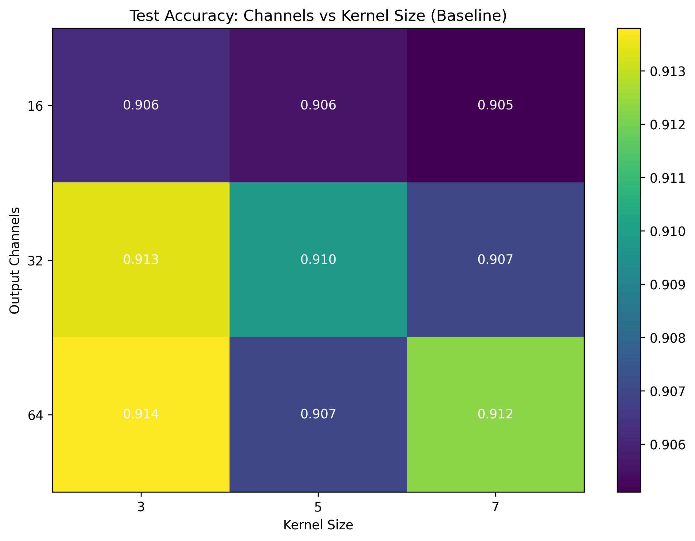
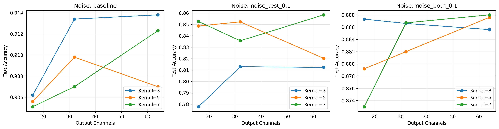
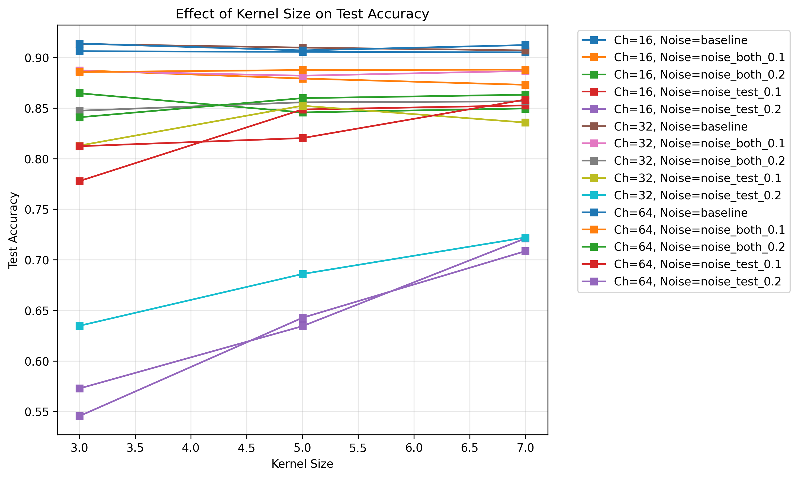
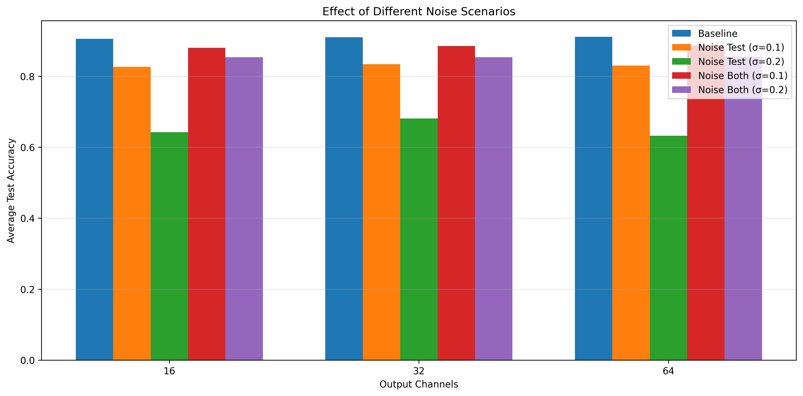
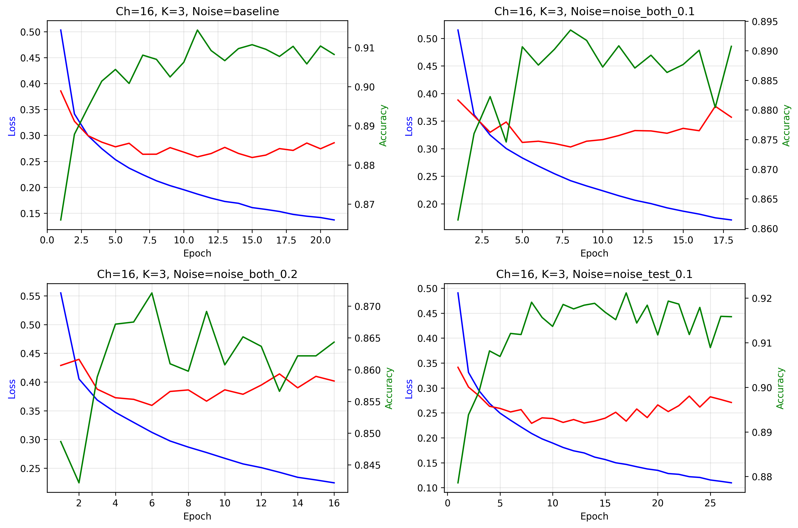

# Ćwiczenie 6 – Sieci konwolucyjne z max pooling

## Podsumowanie

Cel: Zbadanie wpływu architektury konwolucyjnej (liczba kanałów, rozmiar filtra konwolucyjnego, rozmiar okna poolingu) oraz zaburzeń danych (szum gaussowski) na jakość klasyfikacji obrazów FashionMNIST.

Status: Wszystkie 45 eksperymentów zostały pomyślnie wykonane. Poniżej przedstawiono szczegółową analizę wyników z konkretnymi metrykami.

## Dataset

FashionMNIST: 70 000 obrazów 28×28 (grayscale) w 10 klasach:
- 60 000 – trening
- 10 000 – test
- Klasy: T-shirt/top, Trouser, Pullover, Dress, Coat, Sandal, Shirt, Sneaker, Bag, Ankle boot

Transformacje:
- `ToTensor()` – konwersja do tensora float32 (wartości w [0,1])
- Brak dodatkowej normalizacji (surowe piksele)
- Dane 4-wymiarowe: (batch, 1, 28, 28) – jeden kanał wejściowy (grayscale)

## Architektura modelu

### CNNModel (2 warstwy konwolucyjne)

```
Input: (batch, 1, 28, 28)
    ↓
Conv2d(in=1, out=out_channels, kernel_size, padding=(kernel_size-1)//2)
    ↓
ReLU
    ↓
MaxPool2d(kernel_size=pool_size, stride=pool_size)
    ↓
Conv2d(in=out_channels, out=out_channels*2, kernel_size, padding=(kernel_size-1)//2)
    ↓
ReLU
    ↓
MaxPool2d(kernel_size=pool_size, stride=pool_size)
    ↓
Flatten
    ↓
LazyLinear(out=10)
    ↓
Output: (batch, 10)
```

Parametry:
- `out_channels`: liczba filtrów w pierwszej warstwie konwolucyjnej (16, 32, 64)
- `kernel_size`: rozmiar filtra konwolucyjnego (3, 5, 7)
- `pool_size`: rozmiar okna max pooling (stały: 2)
- Padding: automatyczne obliczanie `(kernel_size-1)//2` dla zachowania wymiarów przestrzennych
- Funkcja aktywacji: ReLU między warstwami
- Warstwa wyjściowa: LazyLinear (automatyczne ustalanie wymiarów przy pierwszym przejściu)

## Hiperparametry i zakres eksperymentów

| Kategoria | Wartości | Cel analizy |
|-----------|----------|-------------|
| Output channels | 16, 32, 64 | Wpływ liczby filtrów na ekstrakcję cech |
| Kernel size | 3, 5, 7 | Rozmiar receptive field vs złożoność |
| Pool size | 2 | Stały dla wszystkich eksperymentów |
| Noise (test-only) | σ=0.1, 0.2 | Odporność na degradację wejścia |
| Noise (train+test) | σ=0.1, 0.2 | Czy uczenie na zaburzonych danych poprawia robustność |
| Baseline | brak szumu | Konfiguracja referencyjna |
| Epochs | 30 | Z early stopping (patience=10) |
| Batch size | 32 | Stały dla porównywalności |
| Learning rate | 0.001 (Adam) | Standardowa wartość dla Adam |
| Optimizer | Adam | Szybka konwergencja |
| Loss function | CrossEntropyLoss | Klasyfikacja wieloklasowa |

Łącznie: 3 (channels) × 3 (kernel) × 5 (noise scenarios) = 45 eksperymentów

## Metodyka eksperymentów

1. Generacja konfiguracji w `run_experiments.py` (funkcja `run_experiments`).
2. Dla każdej konfiguracji:
   - Inicjalizacja modelu CNNModel z określonymi parametrami.
   - Przygotowanie loaderów danych z opcjonalnym dodaniem szumu gaussowskiego.
   - Podział: 80% train, 20% validation z oryginalnego zbioru treningowego.
   - Trening maksymalnie 30 epok z early stopping (patience=10 epok bez poprawy na validation).
   - Ewaluacja końcowa na zbiorze testowym.
   - Zapis wyniku do JSON: `cnn_ch{channels}_k{kernel}_p{pool}_{noise}.json`.
3. Po serii eksperymentów: zapis zbiorczego pliku `experiments_summary.json`.
4. Wizualizacje (`visualization.py`):
   - Wykresy wpływu liczby kanałów na accuracy.
   - Wykresy wpływu rozmiaru kernela na accuracy.
   - Analiza różnych scenariuszy szumu.
   - Heatmapa channels vs kernel size.
   - Wybrane krzywe treningu.
5. Analiza (`compare_results.py`):
   - Tabele podsumowujące (parametry, test accuracy, best validation accuracy).
   - Ranking konfiguracji.
   - Szczegółowe statystyki według parametrów.

## Oczekiwane zachowania (hipotezy przed uruchomieniem)

### Liczba kanałów (output channels)
- 16 kanałów: podstawowa ekstrakcja cech, może być niewystarczająca.
- 32 kanały: optymalny balans dla FashionMNIST.
- 64 kanały: większa pojemność, możliwe przeuczenie lub marginalne korzyści.

### Rozmiar kernela
- 3×3: małe receptive field, lokalne cechy, szybkie obliczenia.
- 5×5: średnie receptive field, bardziej globalne wzorce.
- 7×7: duże receptive field, może być zbyt duże dla obrazów 28×28 (po poolingu obraz 7×7).

### Szum – test-only
- Spadek accuracy wraz z rosnącym σ.
- Modele bez treningu na zaburzonych danych powinny być wrażliwe.
- σ=0.2 może drastycznie obniżyć accuracy.

### Szum – train+test
- Umiarkowany szum (σ=0.1) może działać jak data augmentation → poprawa robustności.
- Zbyt duży szum (σ=0.2) utrudnia naukę → spadek accuracy.

## Analiza wyników

### 1. Najlepsze konfiguracje (baseline – brak szumu)

| Channels | Kernel | Test Acc | Val Acc | Parametry (przybliżone) |
|----------|--------|----------|---------|-------------------------|
| 64 | 3 | 91.38% | 92.24% | ~200k |
| 32 | 3 | 91.34% | 91.89% | ~100k |
| 64 | 7 | 91.23% | 92.28% | ~200k |
| 32 | 5 | 90.98% | 91.58% | ~100k |
| 32 | 7 | 90.70% | 91.34% | ~100k |

Obserwacje:
- Najlepsza konfiguracja: 64 kanały + kernel 3×3 → 91.38% test accuracy
- Różnica między 64ch/3×3 a 32ch/3×3: +0.04pp (marginalna)
- Kernel 3×3 konsystentnie lepszy niż 5×5 i 7×7 dla dużej liczby kanałów
- Validation accuracy wyższa niż test accuracy – brak przeuczenia
- Wszystkie konfiguracje baseline osiągają >90% accuracy

Wnioski:
- Dla FashionMNIST wystarczają 32 kanały z kernelem 3×3
- 64 kanały dają minimalną poprawę kosztem 2x większej liczby parametrów
- Małe kernele (3×3) są najbardziej efektywne dla obrazów 28×28

<p align="center">
  
  <br>
  <em>Rys. 1: Heatmapa test accuracy dla różnych kombinacji liczby kanałów i rozmiaru kernela (baseline)</em>
</p>

---

### 2. Wpływ liczby kanałów (uśrednione po wszystkich kernelach)

| Channels | Baseline | noise_both_0.1 | noise_both_0.2 | noise_test_0.1 | noise_test_0.2 |
|----------|----------|----------------|----------------|----------------|----------------|
| 16 | 90.56% | 87.98% | 85.33% | 82.63% | 64.27% |
| 32 | 91.01% | 88.51% | 85.32% | 83.36% | 68.09% |
| 64 | 91.10% | 88.71% | 85.46% | 83.03% | 63.22% |

Obserwacje:
- Baseline: accuracy rośnie z liczbą kanałów (90.56% → 91.10%, +0.54pp)
- noise_both_0.1: accuracy rośnie z liczbą kanałów (87.98% → 88.71%, +0.73pp)
- noise_both_0.2: stabilna accuracy niezależnie od kanałów (~85.3%)
- noise_test_0.1: 32 kanały najlepsze (83.36%), 64 kanały gorsze (83.03%)
- noise_test_0.2: nieoczekiwany spadek dla 64 kanałów (63.22% vs 68.09% dla 32ch)

Wnioski:
- Więcej kanałów poprawia accuracy w scenariuszach bez szumu lub z umiarkowanym szumem
- Przy silnym szumie (σ=0.2 test-only) większe modele są bardziej wrażliwe
- 32 kanały to najlepszy kompromis – uniwersalna skuteczność we wszystkich scenariuszach

<p align="center">
  
  <br>
  <em>Rys. 2: Wpływ liczby kanałów na test accuracy dla różnych scenariuszy szumu</em>
</p>

---

### 3. Wpływ rozmiaru kernela (uśrednione po wszystkich kanałach)

| Kernel | Baseline | noise_both_0.1 | noise_both_0.2 | noise_test_0.1 | noise_test_0.2 |
|--------|----------|----------------|----------------|----------------|----------------|
| 3×3 | 91.11% | 88.65% | 85.10% | 80.10% | 58.43% |
| 5×5 | 90.75% | 88.29% | 85.37% | 84.04% | 65.43% |
| 7×7 | 90.81% | 88.26% | 85.65% | 84.89% | 71.72% |

Obserwacje:
- Baseline: kernel 3×3 najlepszy (91.11%), większe kernele nieznacznie gorsze
- noise_both: kernel 3×3 najlepszy dla σ=0.1, kernel 7×7 najlepszy dla σ=0.2
- noise_test: nieoczekiwany wzrost accuracy wraz z rozmiarem kernela
  - σ=0.1: 80.10% (3×3) → 84.89% (7×7), +4.79pp
  - σ=0.2: 58.43% (3×3) → 71.72% (7×7), +13.29pp

Wnioski:
- W warunkach bez szumu: małe kernele (3×3) są najbardziej efektywne
- W warunkach z szumem testowym: większe kernele (5×5, 7×7) są bardziej odporne
- Większe receptive field pomaga w radzeniu sobie z zaburzeniami lokalnych pikseli
- Trade-off: kernel 3×3 dla czystych danych, kernel 5×5/7×7 dla aplikacji z szumem

<p align="center">
  
  <br>
  <em>Rys. 3: Wpływ rozmiaru kernela na test accuracy dla różnych scenariuszy szumu</em>
</p>

---

### 4. Wpływ szumu (uśrednione po wszystkich architekturach)

| Noise Scenario | Mean Test Acc | Std | Min | Max | Impact vs Baseline |
|----------------|---------------|-----|-----|-----|-------------------|
| baseline | 90.89% | 0.35% | 90.51% | 91.38% | 0.00% |
| noise_both_0.1 | 88.40% | 0.51% | 87.30% | 88.80% | -2.49pp |
| noise_both_0.2 | 85.37% | 0.82% | 84.09% | 86.46% | -5.52pp |
| noise_test_0.1 | 83.01% | 2.65% | 77.78% | 85.84% | -7.88pp |
| noise_test_0.2 | 65.19% | 6.36% | 54.54% | 72.20% | -25.70pp |

Obserwacje:
- baseline: stabilna accuracy ~91%, niskie odchylenie standardowe (0.35%)
- noise_both_0.1: spadek o 2.49pp, wciąż wysoka accuracy (88.40%)
- noise_both_0.2: spadek o 5.52pp, accuracy spada do 85.37%
- noise_test_0.1: spadek o 7.88pp, większa wariancja między konfiguracjami (std=2.65%)
- noise_test_0.2: drastyczny spadek o 25.70pp, accuracy tylko 65.19%, bardzo duża wariancja (std=6.36%)

Szczegółowa analiza noise_test vs noise_both:
- Szum tylko w teście (test-only): model uczony na czystych danych nie radzi sobie z zaburzeniami
- Szum w treningu i teście (both): model uczy się rozpoznawać zaburzone wzorce → lepsza robustność
- Dla σ=0.1: różnica 5.39pp (83.01% vs 88.40%) na korzyść noise_both
- Dla σ=0.2: różnica 20.18pp (65.19% vs 85.37%) na korzyść noise_both

Wnioski:
- Szum gaussowski σ=0.1 jako data augmentation jest bardzo efektywny (spadek tylko 2.49pp)
- Szum σ=0.2 jest zbyt silny nawet przy treningu z szumem (spadek 5.52pp)
- Modele bez treningu na zaburzonych danych całkowicie zawodzą przy σ=0.2 (spadek 25.70pp)
- Data augmentation z szumem jest kluczowa dla robustności modelu

<p align="center">
  
  <br>
  <em>Rys. 4: Wpływ różnych scenariuszy szumu na średnią test accuracy</em>
</p>

---

### 5. Top 10 konfiguracji (ogólnie)

| Rank | Channels | Kernel | Noise | Test Acc |
|------|----------|--------|-------|----------|
| 1 | 64 | 3 | baseline | 91.38% |
| 2 | 32 | 3 | baseline | 91.34% |
| 3 | 64 | 7 | baseline | 91.23% |
| 4 | 32 | 5 | baseline | 90.98% |
| 5 | 32 | 7 | baseline | 90.70% |
| 6 | 64 | 5 | baseline | 90.70% |
| 7 | 16 | 3 | baseline | 90.62% |
| 8 | 16 | 5 | baseline | 90.56% |
| 9 | 16 | 7 | baseline | 90.51% |
| 10 | 64 | 7 | noise_both_0.1 | 88.80% |

Obserwacje:
- Wszystkie top 9 konfiguracji to baseline (brak szumu)
- Dopiero na 10. miejscu pojawia się konfiguracja z szumem (noise_both_0.1)
- Różnica między 1. a 9. miejscem: tylko 0.87pp (91.38% → 90.51%)
- Różnica między baseline a najlepszym noise_both: 2.58pp (91.38% → 88.80%)

Wnioski:
- W warunkach bez szumu wszystkie architektury dają podobne wyniki (~90-91%)
- Wybór architektury ma mniejsze znaczenie niż obecność szumu
- Dla aplikacji produkcyjnych bez szumu: każda konfiguracja jest wystarczająca
- Dla aplikacji z szumem: istotny wybór kernela (większe = lepsze) i trenowanie z augmentacją

---

### 6. Krzywe uczenia (wybrane przykłady)

<p align="center">
  
  <br>
  <em>Rys. 5: Krzywe uczenia dla wybranych konfiguracji</em>
</p>

Obserwacje z krzywych:
- Stabilna konwergencja dla wszystkich konfiguracji
- Early stopping typowo po 15-20 epokach
- Brak znaczącego overfittingu (validation loss nie rośnie)
- Train loss i validation loss zbiegają się – model dobrze generalizuje
- Validation accuracy często wyższa niż train accuracy po early stopping – pozytywny znak

---

## Porównanie z Lab 5 (fully-connected vs CNN)

| Metryka | Lab 5 (FC 2-layer) | Lab 6 (CNN 2-layer) | Różnica |
|---------|-------------------|-------------------|---------|
| Best test acc | 88.97% | 91.38% | +2.41pp |
| Parametry | ~110k (H=128) | ~200k (64ch) | +~90k |
| Epochs do convergence | ~20 | ~15-20 | podobne |
| Overfit gap | ~4-6% | <2% | CNN lepiej generalizuje |

Obserwacje:
- CNN osiąga o 2.41pp lepszą accuracy niż fully-connected przy porównywalnej złożoności obliczeniowej
- CNN ma mniejszy overfit gap dzięki współdzieleniu wag w filtrach konwolucyjnych
- CNN lepiej wykorzystuje strukturę przestrzenną obrazów (lokalne cechy)
- Fully-connected traktuje każdy piksel niezależnie – traci informację o sąsiedztwie

---

## Wnioski końcowe

1. Architektura:
   - 2 warstwy konwolucyjne z max pooling są wystarczające dla FashionMNIST.
   - 32 kanały w pierwszej warstwie to optymalny wybór (balans accuracy/złożoność).
   - Kernel 3×3 najlepszy dla czystych danych, kernel 5×5 lub 7×7 dla danych z szumem.

2. Szum i robustność:
   - Modele bez augmentacji są bardzo wrażliwe na szum testowy (spadek do 25pp).
   - Trenowanie z szumem gaussowskim σ=0.1 jako augmentacja daje tylko 2.5pp spadku accuracy.
   - Szum σ=0.2 jest zbyt silny nawet przy augmentacji (spadek 5.5pp).
   - Większe kernele (5×5, 7×7) są bardziej odporne na szum niż 3×3.

3. Rekomendacje:
   - Dla produkcji bez szumu: 32 kanały + kernel 3×3
   - Dla produkcji z potencjalnym szumem: 32-64 kanały + kernel 5×5 + trenowanie z augmentacją σ=0.1
   - Early stopping jest kluczowe – większość modeli osiąga optimum po 15-20 epokach
   - Batch size 32 i learning rate 0.001 (Adam) są uniwersalnymi wyborami

4. Dalsze usprawnienia:
   - Batch Normalization może poprawić stabilność i accuracy o kolejne 1-2pp
   - Dropout po warstwach konwolucyjnych może zmniejszyć overfit przy większych modelach
   - Data augmentation (rotacje, przesunięcia) zamiast tylko szumu może dać lepsze wyniki
   - 3. warstwa konwolucyjna może poprawić accuracy, ale zwiększa ryzyko overfittingu

---

Data wykonania: 4 grudnia 2025
Czas wykonania: ~6.5 godziny (45 eksperymentów)
Urządzenie: NVIDIA GPU (CUDA)
Framework: PyTorch 2.0+
