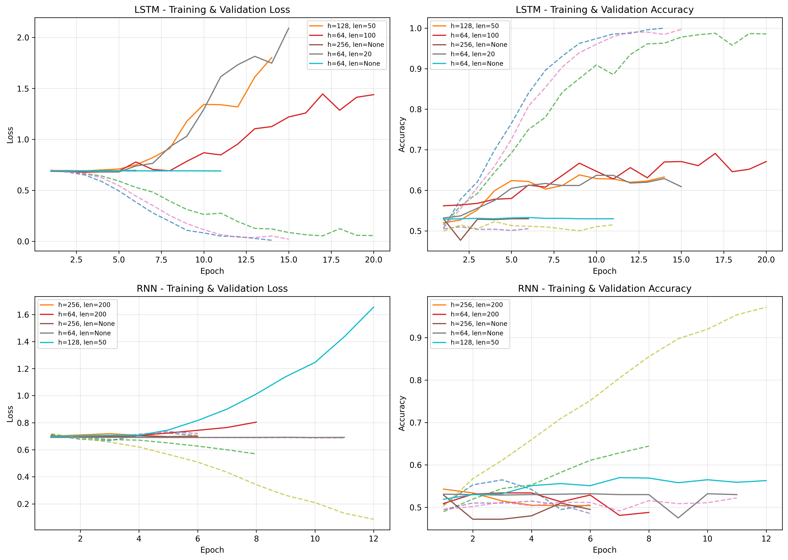
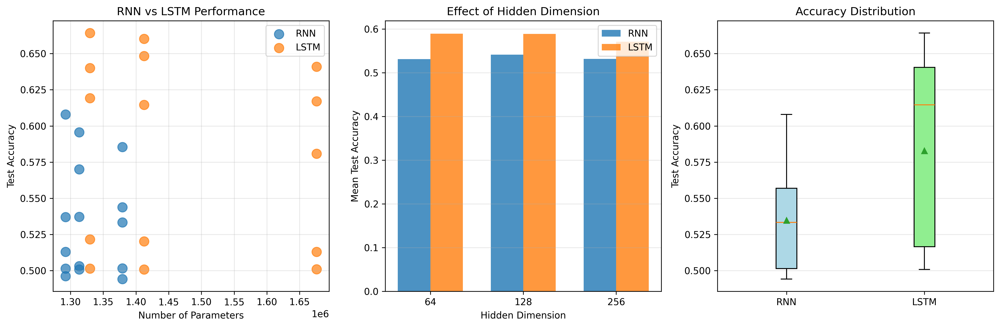
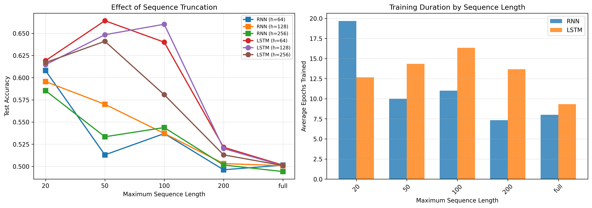
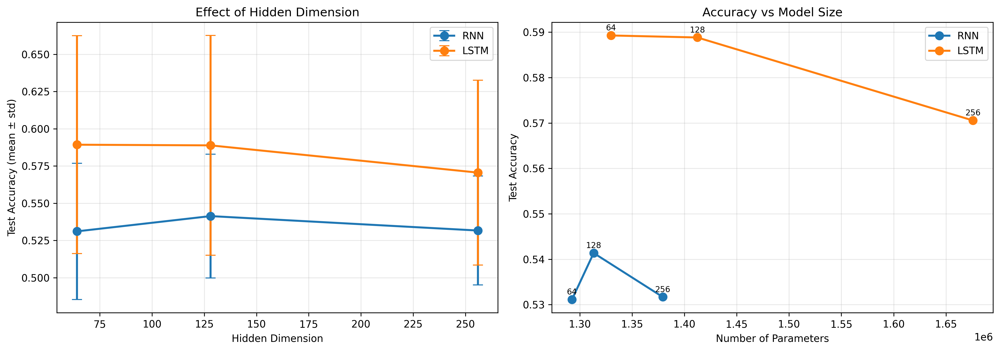

# Lab 7 – RNN/LSTM dla IMDB (subsample 20%)

## Cel

Zbadanie, jak wybór typu warstwy rekurencyjnej (RNN vs LSTM), rozmiaru warstwy ukrytej oraz przycinania sekwencji wpływa na skuteczność klasyfikacji sentymentu w zbiorze IMDB.

## Dane i podział

- IMDB (25k train / 25k test), wykorzystano 20% próbek dla przyspieszenia (losowy subsample po paddingu).
- Słownik: 10k najczęstszych słów, padding token=0.
- Przycinanie sekwencji: brak (full) lub max_len ∈ {20, 50, 100, 200}.

## Architektura i trening

- Modele: `RecurrentNet` (RNN lub LSTM), 1 warstwa, dropout 0.5, Embedding 128.
- Klasy: 2 (sentiment), optymalizator Adam, lr=0.001, batch=64.
- Epoki max 20, early stopping patience=5 na walidacji.
- Metryki: accuracy (train/val/test), historia loss/accuracy.

## Plan eksperymentów

- Siatka 30 konfiguracji: 2 typy (RNN/LSTM) × hidden_dim ∈ {64, 128, 256} × max_len ∈ {full, 20, 50, 100, 200}.
- Wyniki zapisane w `results/*.json`, podsumowanie `results/summary.csv`, wizualizacje w `results/*.png`.

## Wyniki kluczowe

Top 5 test accuracy:

| RNN Type | Hidden | max_len | Test Acc | Best Val Acc | Epochs |
|---------|--------|---------|----------|--------------|--------|
| LSTM | 64 | 50 | 0.6642 | 0.6490 | 14 |
| LSTM | 128 | 100 | 0.6602 | 0.6860 | 19 |
| LSTM | 128 | 50 | 0.6484 | 0.6380 | 14 |
| LSTM | 256 | 50 | 0.6410 | 0.6630 | 15 |
| LSTM | 64 | 100 | 0.6400 | 0.6910 | 20 |

Średnie (wszystkie 30 exp):

- RNN: test acc 0.5347 ± 0.0387 (best 0.6080, worst 0.4942)
- LSTM: test acc 0.5829 ± 0.0653 (best 0.6642, worst 0.5008)
- Różnica LSTM−RNN: +0.048 średnio, +0.0812 medianowo.

Efekt długości sekwencji (mean test acc):

- LSTM: len 20 → 0.617; 50 → 0.651; 100 → 0.627; 200 → 0.518; full → 0.501.
- RNN: len 20 → 0.596; 50 → 0.539; 100 → 0.539; 200 → 0.500; full → 0.499.

Efekt hidden_dim (mean test acc):

- LSTM: 64 → 0.589; 128 → 0.589; 256 → 0.571 (brak zysków z większego wymiaru, delikatny spadek dla 256).
- RNN: 64 → 0.531; 128 → 0.541; 256 → 0.532 (różnice małe, optimum ~128).

## Obserwacje

- LSTM wyraźnie lepszy od prostego RNN na tym zadaniu tekstowym (ok. +5pp średnio).
- Najlepsze wyniki uzyskano przy umiarkowanym przycięciu sekwencji (50–100 tokenów). Zarówno zbyt krótkie (20) jak i pełne sekwencje obniżały skuteczność.
- Większe hidden_dim nie poprawiały jakości; wręcz dla LSTM 256 obserwowany był lekki spadek. Przy subsamplu 20% małe/średnie modele generalizowały lepiej.
- Overfitting: top konfiguracje miały bardzo wysoką accuracy treningową (~0.99) i rosnące val loss, co wskazuje na pewne przeuczenie mimo early stopping.
- Czas/epoki: średnio 12 epok do zatrzymania (max 20). Konfiguracje z dłuższymi sekwencjami lub LSTM 128/64 dochodziły do 19–20 epok.

## Wnioski

1. LSTM z umiarkowanym przycięciem (50–100 tokenów) to kompromis dokładność/koszt; najlepszy model: LSTM, hidden=64, max_len=50 (test acc 0.664).
2. Skracanie do 20 tokenów traci kontekst; pozostawienie pełnej długości także pogarsza (szum, dłuższe sekwencje, mniej przykładów na batch).
3. Większe hidden_dim nie opłaca się na tym subsamplu – można utrzymać 64–128, oszczędzając parametry i czas.
4. Potencjalne ulepszenia: dropout/weight decay, dwukierunkowy LSTM, lepszy scheduler, prosty preprocessing (usunięcie bardzo rzadkich tokenów) albo użycie pretrained embeddings.

## Wpływ pojedynczych czynników (ceteris paribus)

### 1. Typ warstwy rekurencyjnej (RNN vs LSTM)

| Typ | Liczba eksperymentów | Test Acc (średnia) | Test Acc (std) | Best | Worst |
|-----|----------------------|-------------------|----------------|------|-------|
| RNN | 15 | 0.5347 | 0.0387 | 0.6080 | 0.4942 |
| LSTM | 15 | 0.5829 | 0.0653 | 0.6642 | 0.5008 |

Obserwacje:

- LSTM osiąga średnio **+4.8pp** wyższą accuracy niż RNN przy zbliżonej liczbie parametrów
- LSTM ma większe odchylenie standardowe (0.0653 vs 0.0387), co oznacza większą wrażliwość na konfigurację
- Najlepszy wynik LSTM (66.42%) przewyższa najlepszy RNN (60.80%) o **+5.6pp**
- LSTM lepiej radzi sobie z długim kontekstem dzięki mechanizmowi bramkowania

---

### 2. Długość sekwencji (max_len)

**RNN:**

| Max Length | Liczba eksperymentów | Test Acc (średnia) | Test Acc (std) | Best | Mean Epochs |
|------------|----------------------|-------------------|----------------|------|-------------|
| 20 | 3 | 0.5963 | 0.0113 | 0.6080 | 19.7 |
| 50 | 3 | 0.5388 | 0.0289 | 0.5700 | 10.0 |
| 100 | 3 | 0.5393 | 0.0039 | 0.5438 | 11.0 |
| 200 | 3 | 0.5003 | 0.0037 | 0.5032 | 7.3 |
| full | 3 | 0.4988 | 0.0040 | 0.5014 | 8.0 |

**LSTM:**

| Max Length | Liczba eksperymentów | Test Acc (średnia) | Test Acc (std) | Best | Mean Epochs |
|------------|----------------------|-------------------|----------------|------|-------------|
| 20 | 3 | 0.6169 | 0.0023 | 0.6192 | 12.7 |
| 50 | 3 | 0.6512 | 0.0119 | 0.6642 | 14.3 |
| 100 | 3 | 0.6270 | 0.0413 | 0.6602 | 16.3 |
| 200 | 3 | 0.5183 | 0.0046 | 0.5216 | 13.7 |
| full | 3 | 0.5011 | 0.0003 | 0.5014 | 9.3 |

Obserwacje:

- Krzywa w kształcie **odwróconego U** dla obu typów
- Optimum: **50–100 tokenów** (szczególnie 50 dla LSTM: 65.12% średnio)
- Zbyt krótkie sekwencje (20 tokenów) obcinają kontekst – RNN radzi sobie lepiej przy 20 niż przy 50 (59.63% vs 53.88%)
- Pełna długość (full, ~200-500 tokenów) drastycznie obniża accuracy do poziomu losowego (~50%)
- Dłuższe sekwencje wymagają więcej epok do konwergencji (LSTM 100: 16.3 epok średnio)

---

### 3. Wymiar warstwy ukrytej (Hidden Dimension)

**RNN:**

| Hidden Dim | Liczba eksperymentów | Test Acc (średnia) | Test Acc (std) | Best | Mean Params |
|------------|----------------------|-------------------|----------------|------|-------------|
| 64 | 5 | 0.5311 | 0.0458 | 0.6080 | 1,292,546 |
| 128 | 5 | 0.5414 | 0.0415 | 0.5956 | 1,313,282 |
| 256 | 5 | 0.5317 | 0.0366 | 0.5854 | 1,379,330 |

**LSTM:**

| Hidden Dim | Liczba eksperymentów | Test Acc (średnia) | Test Acc (std) | Best | Mean Params |
|------------|----------------------|-------------------|----------------|------|-------------|
| 64 | 5 | 0.5893 | 0.0731 | 0.6642 | 1,329,794 |
| 128 | 5 | 0.5888 | 0.0738 | 0.6602 | 1,412,354 |
| 256 | 5 | 0.5706 | 0.0620 | 0.6410 | 1,675,778 |

Obserwacje:

- Brak wyraźnych korzyści ze zwiększania hidden_dim powyżej 64
- RNN: 128 najlepszy średnio (54.14%), ale różnice minimalne (~1pp)
- LSTM: 64 i 128 niemal identyczne (~58.9%), **256 gorsze** (57.06%) – spadek -1.8pp
- Większe modele (256) mają więcej parametrów (+26% względem 64), ale nie przekłada się to na lepszą accuracy
- Przy 20% danych modele **64–128 generalizują lepiej** niż 256 (symptom nadparametryzacji)

---

### 4. Podsumowanie wpływu czynników

| Czynnik | Kierunek wpływu | Optimum | Magnitude efektu |
|---------|-----------------|---------|------------------|
| Typ warstwy | LSTM > RNN | LSTM | +4.8pp średnio |
| Długość sekwencji | Odwrócone U | 50–100 tokenów | +15pp (50 vs full dla LSTM) |
| Hidden dimension | Plateau po 64 | 64–128 | <2pp różnicy |
| Liczba parametrów | Brak monotonii | 1.3–1.4M | Większe ≠ lepsze |

## Pliki pomocnicze

- Wyniki: `results/*.json`, `results/summary.csv`, `results/experiments_summary.json`.
- Wykresy: `results/training_curves.png`, `results/rnn_type_comparison.png`, `results/truncation_effect.png`, `results/hidden_dim_effect.png`.
- Analiza: `compare_results.py`, wizualizacje: `visualization.py`, eksperymenty: `run_experiments.py`, szybkie sanity: `quick_test.py`.

## Wizualizacje

- Krzywe trening/val (loss, accuracy) dla pierwszych konfiguracji LSTM i RNN. Widać wyższe i stabilniejsze walidacje dla LSTM oraz szybsze nasycanie RNN.

- Porównanie typów: LSTM dominuje RNN przy podobnej liczbie parametrów; przy większych hidden_dim różnice rosną na korzyść LSTM.

- Efekt max_len: najlepsze wyniki przy 50–100 tokenach; zbyt krótkie sekwencje (20) i pełne długości obniżają accuracy. Środkowy wykres pokazuje też, że dłuższe sekwencje zwiększają liczbę epok do zatrzymania.

- Hidden_dim: przyrost parametrów nie daje wyraźnego zysku; optimum pozostaje przy 64–128. LSTM 256 traci kilka pp.
